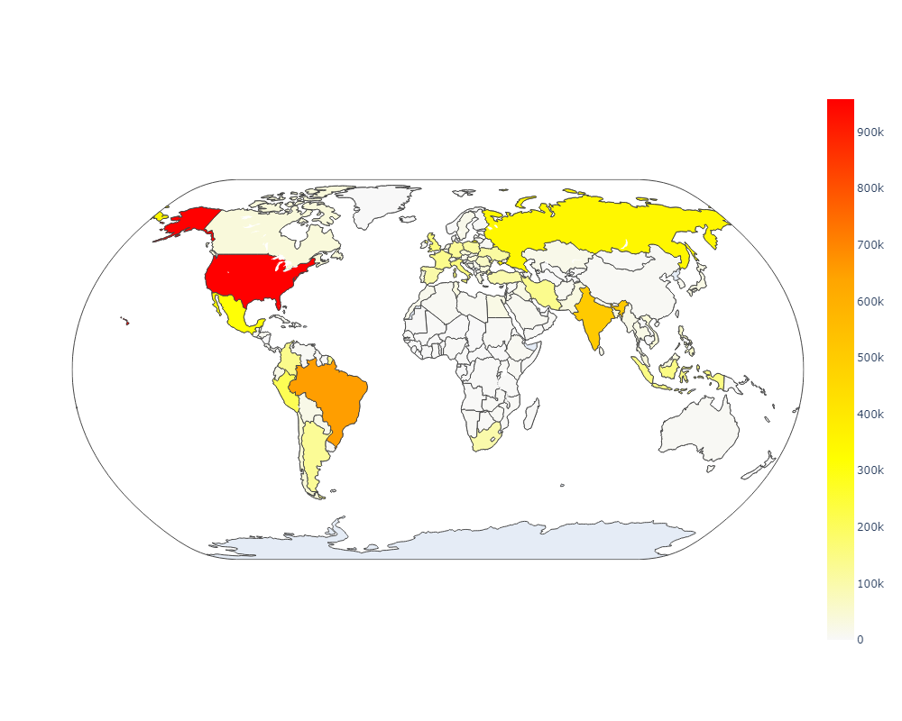
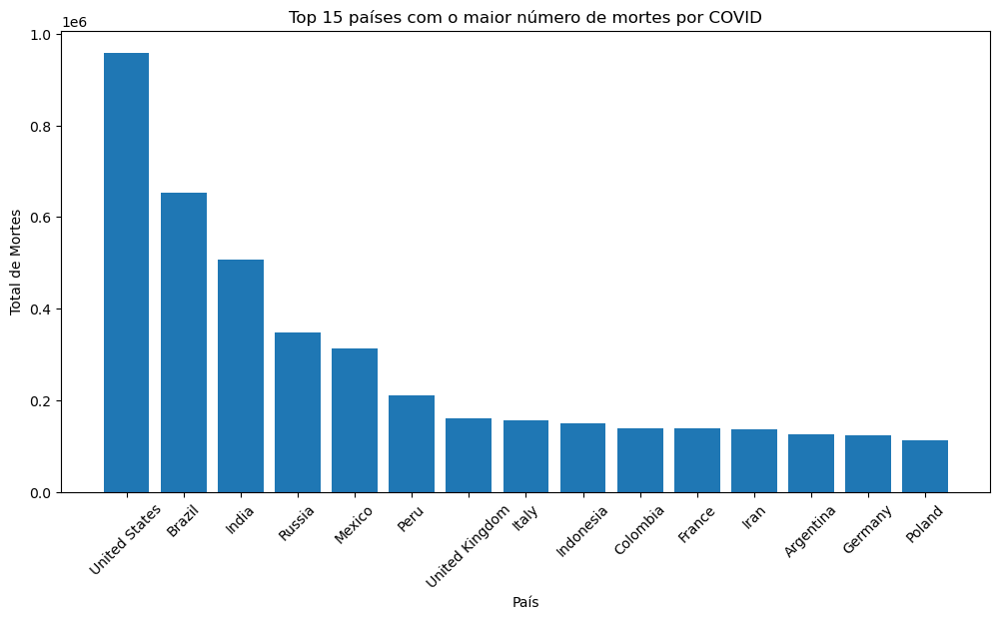
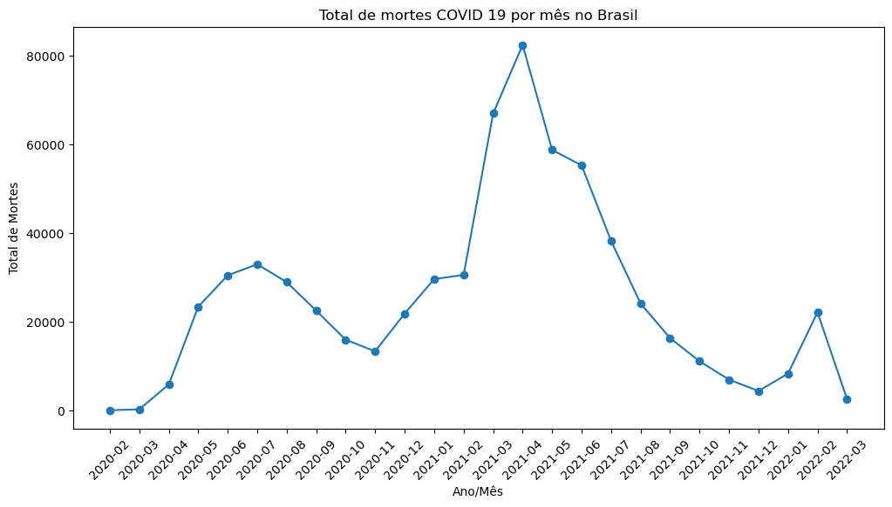

# Objetivo da Atividade:
Utilizar um dataset real para apresentar informações visualmente, explorando pelo menos três técnicas distintas de visualização com Python.
### Link do dataset real utilizado:
https://www.kaggle.com/datasets/georgesaavedra/covid19-dataset

## Apresentação do Projeto:
Projeto com dados sobre a quantidade de mortes no mundo e no Brasil por COVID-19.

## Gráficos:
### Choropleth:

Com base no gráfico de mapa(choropleth) que representa as mortes por COVID-19 por país, é de facil percepção que os Estados Unidos, Brasil e Índia são os países que mais foram impactados por essa doença. Essas nações enfrentaram um alto número de óbitos relacionados à COVID-19, refletindo um impacto significativo que a pandemia teve nessas regiões.
Além disso, é possível observar que a maior parte do mundo foi afetada pela doença, evidenciando a natureza global da pandemia.
Obs: A visualização desse mapa na execução do código é melhor, pois há interação.

---
### Barras:

Com base no gráfico de Barras, temos o total de mortes por COVID-19 agrupadas por país em um ranking top 15, do maior para o menor. Importante observar que a descrição do eixo Y, 0.2 por exemplo, trata-se de 200mil , ou seja, os Estados Unidos e o Brasil tiveram mais de 600mil mortes por Covid-19, um número altíssimo. E Muitos países desse top 15 ficaram próximos aos 200mil, evidenciando mais uma vez essa pandemia que foi o COVID-19.

---
### Linhas:

Com base no gráfico de Linhas, temos um gráfico temporal com o total de mortes no Brasil, considerando de Fev/2020 até Mar/2023. É possivel identificar que as festas de fim de ano de 2020 e o Carnaval de fev/2021, fizeram com que o número de mortes aumentassem muito. Só pra ter uma noção, em Abr/2021 foram aproximadamente 80mil mortes por COVID-19.

